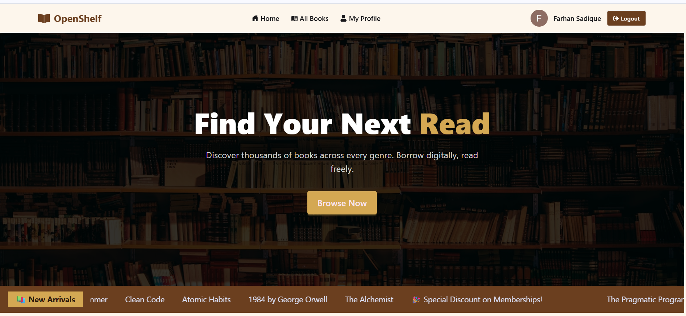
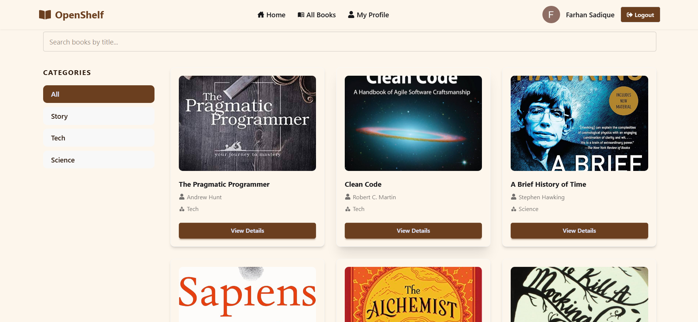
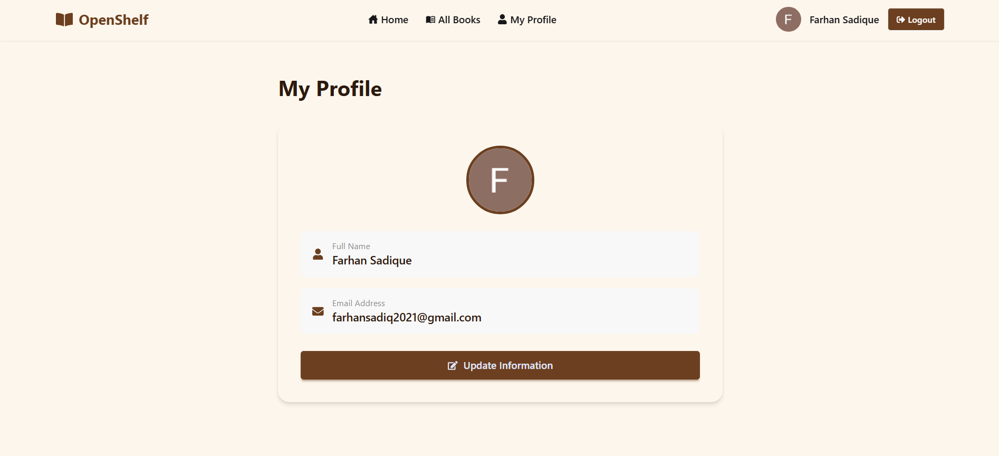

# OpenShelf 📚

A seamless and modern online book borrowing platform that digitizes the traditional library experience.

## 🔗 Live URL
[OpenShelf Live](https://open-shelf-ten.vercel.app)

## 🎯 Purpose
OpenShelf allows users to explore a vast collection of books, filter by categories, and borrow titles digitally. The platform prioritizes security and performance using BetterAuth, Next.js, and MongoDB.

## ✨ Key Features
- 🔐 Email & Google Authentication (BetterAuth)
- 📖 Browse 12+ books across Story, Tech, and Science categories
- 🔍 Search books by title
- 🗂️ Filter books by category
- 📋 View detailed book information
- 👤 Personal profile with update functionality
- 🔒 Private routes for authenticated users
- 📱 Fully responsive on mobile, tablet, and desktop

## 📸 Screenshots

### Homepage


### All Books Page


### Profile Page


## 📦 NPM Packages Used
- `next` — React framework
- `better-auth` — Authentication
- `mongodb` — Database
- `react-hook-form` — Form handling
- `react-toastify` — Toast notifications
- `react-icons` — Icons
- `react-fast-marquee` — Scrolling marquee
- `swiper` — Testimonials carousel
- `tailwindcss` — Styling
- `daisyui` — UI components

## 🛠️ Tech Stack
- Next.js 16
- Tailwind CSS
- DaisyUI
- BetterAuth
- MongoDB

## ⚙️ Run Locally

1. Clone the repository
```bash
   git clone https://github.com/farhansm01/OpenShelf.git
   cd OpenShelf
```
2. Install dependencies
```bash
   npm install
```
3. Set up environment variables — create a `.env.local` file:
```env
   MONGODB_URI=your_mongodb_connection_string
   BETTER_AUTH_SECRET=your_secret
   GOOGLE_CLIENT_ID=your_google_client_id
   GOOGLE_CLIENT_SECRET=your_google_client_secret
```
4. Run the development server
```bash
   npm run dev
```
5. Open [http://localhost:3000](http://localhost:3000) in your browser
